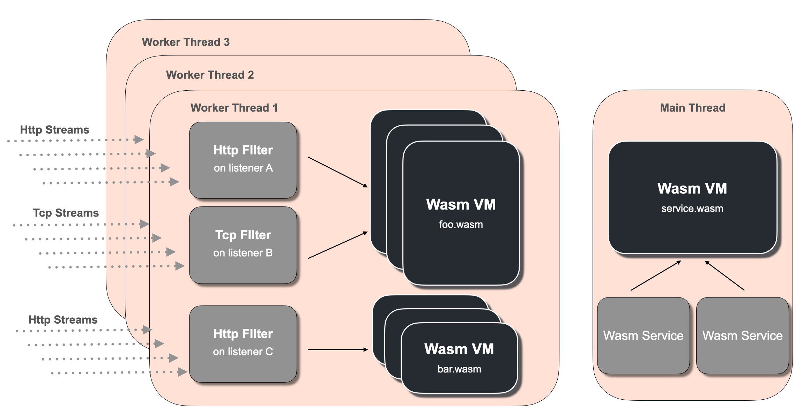
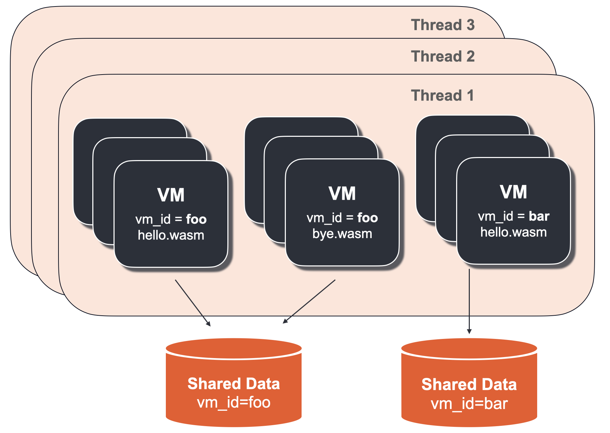
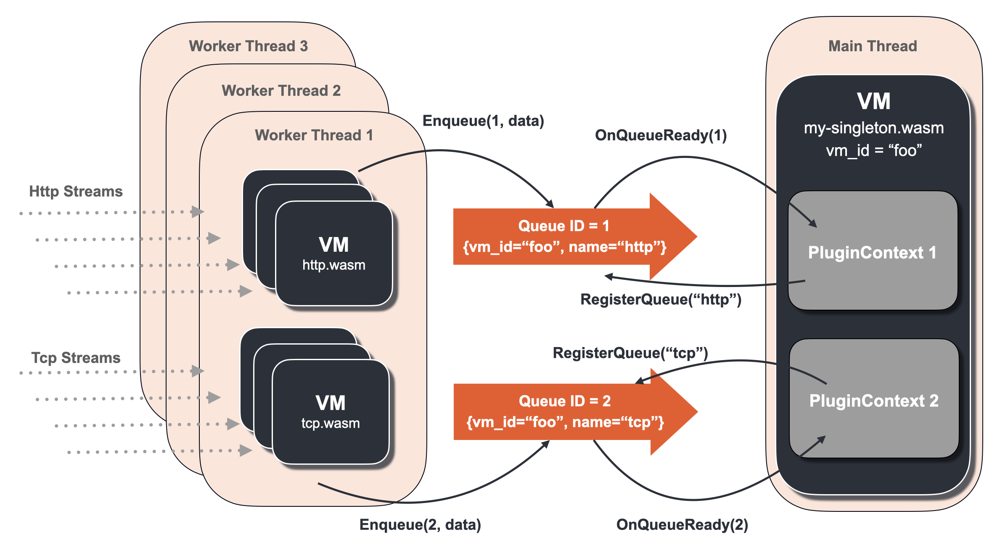

# Introduction

Proxy-Wasm project's key objective is to bring the extensibility to network proxies with any programming language in a flexible way.

This Proxy-Wasm Go SDK is the SDK for extending network proxies (e.g. Envoyproxy) on top of the [Proxy-Wasm ABI specification](https://github.com/proxy-wasm/spec) with Go programming language, and the Proxy-Wasm ABI defines the interface between network proxies and Wasm virtual machines running inside network proxies.

With this SDK, everyone can produce Proxy-Wasm spec compatible Wasm binaries easily *without knowing Proxy-Wasm ABI specification* which is low-level and overwhelming to anyone who doesn't have the expertise in this field. Instead, developers rely on the Go API of this SDK to perform what they want to do to extend network proxies.

This document explains the things you should know when writing programs with this SDK for your custom plugins.

**Note that this document assumes that you are using Envoyproxy, and relies on its implementation detail**. Therefore some statement may not apply to other network proxies such as [mosn](https://github.com/mosn).

# TinyGo vs the official Go compiler

This SDK relies on the TinyGo, a compiler implementation of Go programming language specification.
So first of all, we answer the question "Why not the official Go?".
As of this writing, the official compiler cannot produce Proxy-Wasm compatible binaries since the exported functions are not supported in the official Go compiler yet.
Please refer to the [discussion](https://github.com/golang/go/issues/65199), which has already been accepted as a proposal.

# Wasm VM, Plugin and Envoy configuration

## Terminology

*Wasm virtual machine (Wasm VM)* or simply *VM* means instances of loaded programs. In Envoy, VMs are usually created in *each thread* and isolated from each other. Therefore, your program will be copied up to the number of threads created by Envoy, and loaded on each of these virtual machines.

*Plugin* means the basic unit of your configuration for extending your network proxies. Proxy-Wasm specification allows for having **multiple plugins in a single VM**. In other words, a VM may be used by multiple plugins of network proxies. With this SDK, there are three types of plugins that you can configure in Envoy; *Http Filter*, *Network(Tcp) Filter*, and *Wasm Service*. Given that, you can write programs which can be run as, for example, Network Filter and Http Filter at the same time.

*Http Filter* is a type of plugins to handle Http protocol such as operating on Http request headers, body, trailers, etc. It uses a VM in worker threads which handle traffic.

*Network Filter* is a type of plugins to handle Tcp protocol such as operating on Tcp data frame, connection establishment, etc. It uses a VM in worker threads which handle traffic.

*Wasm Service* is a type of plugins running in a singleton VM (i.e. only one instance exists in the Envoy main thread). It is mainly used for doing some extra work in parallel to Network or Http Filters such as aggregating metrics, logs, etc. Sometimes, such a singleton VM itself is also called *Wasm Service*.



## Envoy configuration

Among all the types of plugins, we share the configuration for Envoy something like

```yaml
vm_config:
  vm_id: "foo"
  runtime: "envoy.wasm.runtime.v8"
  configuration:
    "@type": type.googleapis.com/google.protobuf.StringValue
    value: '{"my-vm-env": "dev"}'
  code:
    local:
      filename: "example.wasm"
configuration:
  "@type": type.googleapis.com/google.protobuf.StringValue
  value: '{"my-plugin-config": "bar"}'
```

where

| Field | Description |
| --- | --- |
| `vm_config` | configures specific Wasm VM on which this plugin runs |
| `vm_config.vm_id` | used for semantic isolation towards Cross-VM communications. Please refer to [Cross-VM communications](#cross-vm-communications) section for detail.|
| `vm_config.runtime` | specifies the Wasm runtime type. Usually set to `envoy.wasm.runtime.v8`. |
| `vm_config.configuration` | arbitray configuration data used for setting up the VM. |
| `vm_config.code` | location of a Wasm binary |
| `configuration` | corresponds to each *Plugin* instance (which we call `PluginContext` explained below) inside the Wasm VM. |

The important thing is that **giving exactly the same `vm_config` field for multiple plugins ends up sharing one Wasm VM among them**. 
That means you can use a single Wasm VM for multiple Http filters, or maybe Http and Tcp filters per thread (See [example config](#sharing-one-vm-among-multiple-plugins-per-thread) for detail). This is useful in terms of memory/cpu resource efficiency, startup latency, etc.

The full API definition is [here](https://www.envoyproxy.io/docs/envoy/latest/api-v3/extensions/wasm/v3/wasm.proto#envoy-v3-api-msg-extensions-wasm-v3-pluginconfig) and this is what we call *plugin config* here and elsewhere.

Now here's some example configurations in Envoy for each plugin type. Note that how your Wasm VM is created by Envoy depends on these types. 

### Http Filter

If a plugin config is given at `envoy.filter.http.wasm`, you can run your program as *Http Filter* plugin so that it can operate on Http events.

```yaml
http_filters:
- name: envoy.filters.http.wasm
  typed_config:
    "@type": type.googleapis.com/envoy.extensions.filters.http.wasm.v3.Wasm
    config:
      vm_config: { ... }
      # ... plugin config follows
- name: envoy.filters.http.router
```

In this case, Wasm VMs are created on *each worker thread* in Envoy, and each VM is responsible for operating on each Http streams on a listener handled by a corresponding worker thread. Note that the way VMs and Plugins get created is exactly the same as [*Network Filter*](#network-filter), and the only difference is that *Plugins* only operate on Http streams rather than Tcp streams.

See [example.yaml](../examples/http_headers/envoy.yaml) for a full example.

### Network Filter

If a plugin config is given at `envoy.filter.network.wasm`, you can run your program as *Network Filter* plugin so that it can operate on Tcp events.

```yaml
filter_chains:
- filters:
    - name: envoy.filters.network.wasm
      typed_config:
        "@type": type.googleapis.com/envoy.extensions.filters.network.wasm.v3.Wasm
        config:
          vm_config: { ... }
          # ... plugin config follows
    - name: envoy.tcp_proxy
```

In this case, Wasm VMs are created on *each worker thread* in Envoy, and each VM is responsible for operating on each Tcp streams on a listener handled by a corresponding worker thread. Note that the way VMs and Plugins get created is exactly the same as [*Http Filter*](#http-filter), and the only difference is that *Plugins* only operate on Tcp streams rather than Http streams.

See [example.yaml](../examples/network/envoy.yaml) for a full example.

### Wasm Service

If a plugin config is given at `envoy.bootstrap.wasm`, you can run your program as *Wasm Service* plugin.

```yaml
bootstrap_extensions:
- name: envoy.bootstrap.wasm
  typed_config:
    "@type": type.googleapis.com/envoy.extensions.wasm.v3.WasmService
    singleton: true
    config:
      vm_config: { ... }
      # ... plugin config follows
```

The top `singleton` field is normally set `true`. In this way, only one VM for this configuration exists across all the threads of Envoy process, and runs on the Envoy's main thread so that it won't block any worker threads.

See [example.yaml](../examples/shared_queue/envoy.yaml) for a full example.

### Sharing one VM among multiple plugins per thread

As we explained, we can share one VM across multiple plugins. Here's an example yaml for such configuration: 

```yaml
static_resources:
  listeners:
    - name: http-header-operation
      address:
        socket_address:
          address: 0.0.0.0
          port_value: 18000
      filter_chains:
        - filters:
            - name: envoy.http_connection_manager
              typed_config:
                # ....
                http_filters:
                  - name: envoy.filters.http.wasm
                    typed_config:
                      "@type": type.googleapis.com/envoy.extensions.filters.http.wasm.v3.Wasm
                      config:
                        configuration:
                          "@type": type.googleapis.com/google.protobuf.StringValue
                          value: "http-header-operation"
                        vm_config:
                          vm_id: "my-vm-id"
                          runtime: "envoy.wasm.runtime.v8"
                          configuration:
                            "@type": type.googleapis.com/google.protobuf.StringValue
                            value: "my-vm-configuration"
                          code:
                            local:
                              filename: "all-in-one.wasm"
                  - name: envoy.filters.http.router

    - name: http-body-operation
      address:
        socket_address:
          address: 0.0.0.0
          port_value: 18001
      filter_chains:
        - filters:
            - name: envoy.http_connection_manager
              typed_config:
                # ....
                http_filters:
                  - name: envoy.filters.http.wasm
                    typed_config:
                      "@type": type.googleapis.com/envoy.extensions.filters.http.wasm.v3.Wasm
                      config:
                        configuration:
                          "@type": type.googleapis.com/google.protobuf.StringValue
                          value: "http-body-operation"
                        vm_config:
                          vm_id: "my-vm-id"
                          runtime: "envoy.wasm.runtime.v8"
                          configuration:
                            "@type": type.googleapis.com/google.protobuf.StringValue
                            value: "my-vm-configuration"
                          code:
                            local:
                              filename: "all-in-one.wasm"
                  - name: envoy.filters.http.router

    - name: tcp-total-data-size-counter
      address:
        socket_address:
          address: 0.0.0.0
          port_value: 18002
      filter_chains:
        - filters:
            - name: envoy.filters.network.wasm
              typed_config:
                "@type": type.googleapis.com/envoy.extensions.filters.network.wasm.v3.Wasm
                config:
                  configuration:
                    "@type": type.googleapis.com/google.protobuf.StringValue
                    value: "tcp-total-data-size-counter"
                    vm_config:
                      vm_id: "my-vm-id"
                      runtime: "envoy.wasm.runtime.v8"
                      configuration:
                        "@type": type.googleapis.com/google.protobuf.StringValue
                        value: "my-vm-configuration"
                      code:
                        local:
                          filename: "all-in-one.wasm"
            - name: envoy.tcp_proxy
              typed_config: # ...
```

You see that `vm_config` fields are all the same on Http filter chains on 18000 and 18001 listeners plus a Network filter chain on 18002. That means one Wasm VM is used by multiple plugins in Envoy per worker thread in this case. In other words, all of `vm_config.vm_id`, `vm_config.runtime` `vm_config.configuration`, and `vm_config.code` must be same in order to reuse the same VMs.

As a result, **Three** [`PluginContext`](#contexts) will be created per Wasm VM and each of them corresponds to each of the above filter configurations (the top `configuration` fields at 18000, 18001, and 18002 respectively).

See [example.yaml](../examples/shared_queue/envoy.yaml) for a full example.

# Proxy-Wasm Go SDK API

So far we have explaind the concepts and *plugin configs*. Now we are ready to dive into the API of this SDK.

## *Contexts*

*Contexts* are collection of interfaces in Proxy-Wasm Go SDK, and all of them are mapped to the concepts  explained above. They are defined in [types](../proxywasm/types) package, and developers are supposed to implement these interfaces in order to extend network proxies.

There are four types of contexts: `VMContext`, `PluginContext`, `TcpContext` and `HttpContext`. Their relationship and how they are mapped to the concepts above can be described as the following diagram:

```
                    Wasm Virtual Machine
                      (.vm_config.code)
┌────────────────────────────────────────────────────────────────┐
│  Your program (.vm_config.code)                TcpContext      │
│          │                                  ╱ (Tcp stream)     │
│          │ 1: 1                            ╱                   │
│          │         1: N                   ╱ 1: N               │
│      VMContext  ──────────  PluginContext                      │
│                                (Plugin)   ╲ 1: N               │
│                                            ╲                   │
│                                             ╲  HttpContext     │
│                                               (Http stream)    │
└────────────────────────────────────────────────────────────────┘
```

To summarize,

1) `VMContext` corresponds to each `.vm_config.code`, and only one `VMContext` exists in each VM.
2) `VMContext` is the parent of *PluginContexts*, and is responsible for creating arbitrary number of `PluginContext`s.
3) `PluginContext` corresponds to a *Plugin* instance. That means, a `PluginContext` corresponds to a *Http Filter* or *Network Filter* or maybe *Wasm Service*, configured via `.configuration` field in the *plugin config*.
4) `PluginContext` is the parent of `TcpContext` and `HttpContext`, and is responsible for creating arbitrary number of these contexts when it is configured at *Http Filter* or *Network Filter*.
5) `TcpContext` is responsible for handling each Tcp stream.
6) `HttpContext` is responsible for handling each Http stream.

So all you have to do is implement `VMContext` and `PluginContext`. And if you want to plug in to *Http Filter* or *Network Filter*, then implement `HttpContext` or `TcpContext` respectively.

Let's look at some of these interfaces. First we see `VMContext` is defined as follows:

```go
type VMContext interface {
	// OnVMStart is called after the VM is created and main function is called.
	// During this call, GetVMConfiguration hostcall is available and can be used to
	// retrieve the configuration set at vm_config.configuration.
	// This is mainly used for doing Wasm VM-wise initialization.
	OnVMStart(vmConfigurationSize int) OnVMStartStatus

	// NewPluginContext is used for creating PluginContext for each plugin configurations.
	NewPluginContext(contextID uint32) PluginContext
}
```

As you expect, `VMContext` is responsible for creating `PluginContext` via `NewPluginContext` method. In addition, `OnVMStart` is called at the startup phase of the VM, and you can retrieve the value of `.vm_config.configuration` via `GetVMConfiguration` [hostcall API](#hostcall-api). This way you can do the VM-wise plugin-independent initialization and control the behavior of `VMContext`.

Next is `PluginContext` and it it defined as (here we omit some of the methods for simplicity)

```go
type PluginContext interface {
	// OnPluginStart is called on all plugin contexts (after OnVmStart if this is the VM context).
	// During this call, GetPluginConfiguration is available and can be used to
	// retrieve the configuration set at config.configuration in envoy.yaml
	OnPluginStart(pluginConfigurationSize int) OnPluginStartStatus

	// The following functions are used for creating contexts on streams,
	// and developers *must* implement either of them corresponding to
	// extension points. For example, if you configure this plugin context is running
	// at Http filters, then NewHttpContext must be implemented. Same goes for
	// Tcp filters.
	//
	// NewTcpContext is used for creating TcpContext for each Tcp streams.
	NewTcpContext(contextID uint32) TcpContext
	// NewHttpContext is used for creating HttpContext for each Http streams.
	NewHttpContext(contextID uint32) HttpContext
}
```

Just like `VMContext`, `PluginContext` has `OnPluginStart` method which is called on the plugin creation in network proxies. During that call, the top level `.configuratin` field's value in the *plugin config* can be retrieved via `GetPluginConfiguration` [hostcall API](#hostcall-api). This way developers can inform a `PluginContext` how it should behave, for example, specifying a `PluginContext` should behave as a Http Filter and which custom headers it should insert as a request headers, etc. 

Also note that `PluginContext` has `NewTcpContext` and `NewHttpContext` methods which are called when creating these contexts in response to each Http or Tcp streams in network proxies.

The definition of `HttpContext` and `TcpContext` is fairly straightforward so please refer to [context.go](../proxywasm/types/context.go) for detail.

## Hostcall API

Hostcall API provides a variety of ways to interact with network proxies from your program, and it is defined at [hostcall.go](../proxywasm/hostcall.go) in [proxywasm](../proxywasm) package. For example, `GetHttpRequestHeaders` API can be used for accessing Http request headers by `HttpContext`. The other example is that `LogInfo` API and it can be used for emitting strings as logs in Envoy.

Please refer to [hostcall.go](../proxywasm/hostcall.go) for all the available hostcalls, and the documentation is given at the function definitions.

## Entrypoint

When Envoy creates VMs, it calls `main` function of your program at startup phase before it tries to create `VMContext` inside VMs. Therefore you must pass your own implementation of `VMContext` in `main` function.

[proxywasm](../proxywasm) package's `SetVMContext` function is the entrypoint used for that purpose. That being said, your `main` function should look like the following:

```go
func main() {
	proxywasm.SetVMContext(&myVMContext{})
}

type myVMContext struct { .... }

var _ types.VMContext = &myVMContext{}

// Implementations follow...
```

# Cross-VM communications

Given that VMs are created in the thread-local way, sometimes we may want to communicate with other VMs. For example, aggregating data or stats, caching data, etc.

There are two concepts for Cross-VM communications called *Shared Data* and *Shared Queue*.

We also recommend you watch [this talk](https://www.youtube.com/watch?v=XdWmm_mtVXI&t=1168s) for introduction.

## *Shared Data (Shared KVS)*

What if you want to have global request counters across all the Wasm VMs running in multiple worker threads? Or what if you want to cache some data that should be used by all of your Wasm VMs? Then *Shared Data* or equivalently *Shared KVS* will come into play.

*Shared Data* is basically a key-value store that is shared across all the VMs (i.e. cross-VM or cross-threads). A shared-data KVS is created per [`vm_id`](#envoy-configuration) specified in the `vm_config`. That means you can share a key-value store across all Wasm VMs not necessarily with the same binary (`vm_config.code`). The only requirement is having the same `vm_id`.



In the diagram above, you see that VMs with "vm_id=foo" share the same shared data storage even though they have different binary (hello.wasm and bye.wasm).

Here's the shared data related API of this Go SDK in [hostcall.go](../proxywasm/hostcall.go):

```go
// GetSharedData is used for retrieving the value for given "key".
// Returned "cas" is be used for SetSharedData on that key for
// thread-safe updates.
func GetSharedData(key string) (value []byte, cas uint32, err error)

// SetSharedData is used for setting key-value pairs in the shared data storage
// which is defined per "vm_config.vm_id" in the hosts.
//
// ErrorStatusCasMismatch will be returned when a given CAS value is mismatched
// with the current value. That indicates that other Wasm VMs has already succeeded
// to set a value on the same key and the current CAS for the key is incremented.
// Having retry logic in the face of this error is recommended.
//
// Setting cas = 0 will never return ErrorStatusCasMismatch and always succeed, but
// it is not thread-safe, i.e. maybe another VM has already set the value
// and the value you see is already different from the one stored by the time
// when you call this function.
func SetSharedData(key string, value []byte, cas uint32) error
```


The API is straightforward, but the important part is its thread-safety and cross-VM-safety with "cas" or [Compare-And-Swap](https://en.wikipedia.org/wiki/Compare-and-swap) value.

Please refer to [an example](../examples/shared_data) for demonstration.

## *Shared Queue*

What if you want to aggregate metrics across all the Wasm VMs in parallel to request/response processing? Or what if you want to push some cross-VM aggregated information to a remote server? Now *Shared Queue* is here for you.

*Shared Queue* is a FIFO(First-In-First-Out) queue created for a pair of `vm_id` and the name of the queue. And a *queue id* is assigned uniquely to the pair (vm_id, name) which is used for enqueue/dequeue operations.

As you expect, the operations such as "enqueue" and "dequeue" have thread-safety and cross-VM-safety. Let's look at the *Shared Queue* related API in [hostcall.go](../proxywasm/hostcall.go):

```golang
// DequeueSharedQueue dequeues an data from the shared queue of the given queueID.
// In order to get queue id for a target queue, use "ResolveSharedQueue" first.
func DequeueSharedQueue(queueID uint32) ([]byte, error)

// RegisterSharedQueue registers the shared queue on this plugin context.
// "Register" means that OnQueueReady is called for this plugin context whenever a new item is enqueued on that queueID.
// Only available for types.PluginContext. The returned queueID can be used for Enqueue/DequeueSharedQueue.
// Note that "name" must be unique across all Wasm VMs which share a same "vm_id".
// That means you can use "vm_id" can be used for separating shared queue namespace.
//
// Only after RegisterSharedQueue is called, ResolveSharedQueue("this vm_id", "name") succeeds
// to retrive queueID by other VMs.
func RegisterSharedQueue(name string) (queueID uint32, err error)

// EnqueueSharedQueue enqueues an data to the shared queue of the given queueID.
// In order to get queue id for a target queue, use "ResolveSharedQueue" first.
func EnqueueSharedQueue(queueID uint32, data []byte) error

// ResolveSharedQueue acquires the queueID for the given vm_id and queue name.
// The returned queueID can be used for Enqueue/DequeueSharedQueue.
func ResolveSharedQueue(vmID, queueName string) (queueID uint32, err error)
```

Basically `RegisterSharedQueue` and `DequeueSharedQueue` are used by "consumer" of the queue 
while `ResolveSharedQueue` and `EnqueueSharedQueue` are for "producer" of queue items. Note that

- `RegisterSharedQueue` is used for creating a shared queue for `name` and `vm_id` of the caller. That means if you want to use a queue, then this must be called by a VM beforehand.  This can be called by `PluginContext`, and therefore we can think of "comsumers" = `PluginContext`s.
- `ResolveSharedQueue` is used for getting the *queue id* for `name` and `vm_id`. Usually this is used by VMs that doesn't call `ResolveSharedQueue` but rather are supposed to enqueue items. This is for "producer".

and both of these calls return a queue id, and it is used for `DequeueSharedQueue` and `EnqueueSharedQueue`.

However, from the consumer's point of view, how can a consumer (= `PluginContext`) be notified when a queue is enqueued with an item? This is why we have the `OnQueueReady(queueID uint32)` interface in `PluginContext`. This method is called whenever an item is enqueued in a queue registered by that `PluginContext`.

Also it is highly recommended that shared queues should be created by a singleton *Wasm Service*, i.e. on the Envoy's main thread. Otherwise `OnQueueReady` is called on worker threads which blocks their processing of Http or Tcp streams.

The following diagram is an illustrative usage of shared queues:



`my-singleton.wasm` is loaded as a singleton VM with `vm_id=foo` where two *Wasm Service* are created which correspond to `PluginContext 1` and `PluginContext 2` in the VM. Each of these plugin contexts calls `RegisterQueue` with "http" and "tcp" names, and that results in creating two corresponding queues. On the other hand, in the worker threads, two types of Wasm VMs are created per thread. They are processing Tcp streams and Http streams, and enqueue some data into the corresponding queues respectively. As we explained above, enqueueing data into a queue ends up calling the `OnQueueReady` method of a `PluginContext` which called `RegisterQueue` for that queue. In this example, enqueueing data into the queue with queue id=2 invokes `OnQueueReady(2)` of `PluginContext 2` in the singleton VM.

Please refer to [an example](../examples/shared_queue) for demonstration.

# Unit tests with testing framework

This SDK contains the testing framework for unit testing Proxy-Wasm programs without actually running network proxies and with the official Go test toolchain. [proxytest](../proxywasm/proxytest) package implements the Envoy proxy emulator. That is, you can run tests just like you do when writing native programs:

```
go test ./...
```

Please refer to `main_test.go` files under [examples](../examples) directory for demonstrations.

# Limitations and Considerations

Here's what users should know when writing plugins with Proxy-Wasm Go SDK and Proxy-Wasm in general.

## Some of existing libraries not available

Some of existing libraries are not available (importable but runtime panic / non-importable). There are several reasons for this:
1. TinyGo's WASI target does not support some of syscall.
2. TinyGo does not implement all of reflect package.
3. [Proxy-Wasm C++ host](https://github.com/proxy-wasm/proxy-wasm-cpp-host) has not supported some of WASI APIs yet 
4. Some language features are not available in TinyGo or Proxy-Wasm: examples include `recover` and `goroutine`.

These issues will be mitigated as TinyGo and Proxy-Wasm evolve.

## Performance overhead due to Garbage Collection

There's performance overhead of using Go/TinyGo due to GC, although, optimistically speaking, we could say that the overhead of GC is small enough compared to the other operations in the proxy.

Internally, `runtime.GC` is called whenever the heap runs out (see 
[1](https://tinygo.org/lang-support/#garbage-collection),
[2](https://github.com/tinygo-org/tinygo/blob/v0.14.1/src/runtime/gc_conservative.go#L218-L239)) in TinyGo.

TinyGo allows us to disable GC, so theoretically, we can implement our own GC algorithms tailored for Proxy-Wasm through with `-gc=custom` and the build tag `-tags=custommalloc`. 
For example, create an arena for each context and free the arena when the context is destroyed. However, it is difficult to implement that 
since internally we need to use global maps (implicitly causes allocation outside the context scope, globally) for saving the Virtual Machine's state (e.g. context id to context implementation mapping).
So this is not implemented yet, and that is a future TODO.

## `recover` not implemented

`recover` is not implemented (https://github.com/tinygo-org/tinygo/issues/891) in TinyGo, and there's no way to prevent the Wasm virtual machine from aborting. Also that means that codes rely on `recover` won't work as expected.

## Goroutine support

In TinyGo, Goroutine is implemented through LLVM's coroutine (see [this blog post](https://aykevl.nl/2019/02/tinygo-goroutines)).

In Envoy, Wasm modules are run in the event driven manner, and therefore the "scheduler" is not executed once the main function exits.
That means you cannot have the expected behavior of Goroutine as in ordinary host environments.

The question "How to deal with Goroutine in a thread local Wasm VM executed in the event drive manner" has yet to be answered.

We strongly recommend that you implement the `OnTick` function for any asynchronous task instead of using Goroutine.
