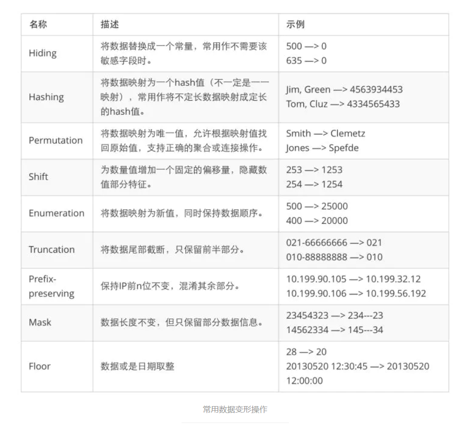

# desensitize

Desensitize也即数据脱敏。数据脱敏也叫数据的去隐私化，在我们给定脱敏规则和策略的情况下，对敏感数据比如：手机号、银行卡号 等信息，进行转换或者修改的一种技术手段，防止敏感数据直接在不可靠的环境下使用。
像政府、医疗行业、金融机构、移动运营商是比较早开始应用数据脱敏的，因为他们所掌握的都是用户最核心的私密数据，如果泄露后果是不可估量的。
数据脱敏的应用在生活中是比较常见的，比如我们在淘宝买东西订单详情中，商家账户信息会被用 * 遮挡，保障了商户隐私不泄露，这就是一种数据脱敏方式。

`desensitize`是一个数据脱敏的`wasm` extensions，支持支持n种类型数据的脱敏，例如：邮箱地址、手机号、身份证、银行卡、车牌号、姓名、家庭地址、ip地址、生日、密码等。

目前支持的脱敏类型为Mask，未来会支持如Hiding、Hashing、Shift、Truncation等。

## 脱敏类型
如下图：



## 配置脱敏
```yaml 
      { 
           configuration:
                '@type': type.googleapis.com/google.protobuf.StringValue
                value: |
                 {
                   "desensitizeTypes": ["PhoneNumber","IdCard"]
                 }
              vm_config:
                code:
                  remote:
                    http_uri:
                      uri: http://10.10.13.47:2333/wasm/desensitize.wasm
                runtime: envoy.wasm.runtime.v8
                vm_id: clean-mall-admin
      }
```

## 构建
```shell
tinygo build -o desensitize.wasm -scheduler=none -target=wasi main.go
```


